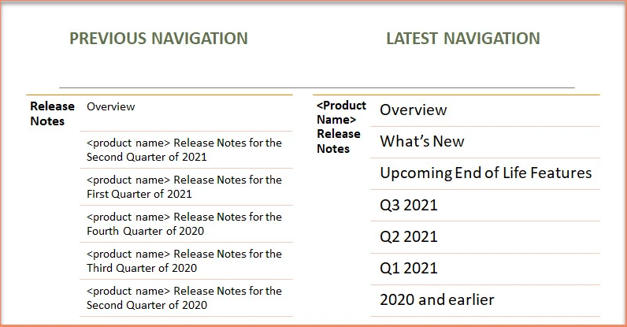

# Technical Writing Handbook

## Introduction

#### Who is a technical writer 
https://natashascribesnm.wordpress.com/2022/06/30/being-a-technical-writer/

#### Why do you need a technical writer 
Lorem ipsum dolor sit amet, consectetur adipiscing elit, sed do eiusmod tempor incididunt ut labore et dolore magna aliqua. Ut enim ad minim veniam, quis nostrud exercitation ullamco laboris nisi ut aliquip ex ea commodo consequat. Duis aute irure dolor in reprehenderit in voluptate velit esse cillum dolore eu fugiat nulla pariatur. Excepteur sint occaecat cupidatat non proident, sunt in culpa qui officia deserunt mollit anim id est laborum

#### What does a technical writer do? 
Value add by technical writer 
Lorem ipsum dolor sit amet, consectetur adipiscing elit, sed do eiusmod tempor incididunt ut labore et dolore magna aliqua. Ut enim ad minim veniam, quis nostrud exercitation ullamco laboris nisi ut aliquip ex ea commodo consequat. Duis aute irure dolor in reprehenderit in voluptate velit esse cillum dolore eu fugiat nulla pariatur. Excepteur sint occaecat cupidatat non proident, sunt in culpa qui officia deserunt mollit anim id est laborum

#### Skills required

## Fundamentals 
Lorem ipsum dolor sit amet, consectetur adipiscing elit, sed do eiusmod tempor incididunt ut labore et dolore magna aliqua. Ut enim ad minim veniam, quis nostrud exercitation ullamco laboris nisi ut aliquip ex ea commodo consequat. Duis aute irure dolor in reprehenderit in voluptate velit esse cillum dolore eu fugiat nulla pariatur. Excepteur sint occaecat cupidatat non proident, sunt in culpa qui officia deserunt mollit anim id est laborum

#### Audience analysis 
Lorem ipsum dolor sit amet, consectetur adipiscing elit, sed do eiusmod tempor incididunt ut labore et dolore magna aliqua. Ut enim ad minim veniam, quis nostrud exercitation ullamco laboris nisi ut aliquip ex ea commodo consequat. Duis aute irure dolor in reprehenderit in voluptate velit esse cillum dolore eu fugiat nulla pariatur. Excepteur sint occaecat cupidatat non proident, sunt in culpa qui officia deserunt mollit anim id est laborum

#### Types of audience 
Lorem ipsum dolor sit amet, consectetur adipiscing elit, sed do eiusmod tempor incididunt ut labore et dolore magna aliqua. Ut enim ad minim veniam, quis nostrud exercitation ullamco laboris nisi ut aliquip ex ea commodo consequat. Duis aute irure dolor in reprehenderit in voluptate velit esse cillum dolore eu fugiat nulla pariatur. Excepteur sint occaecat cupidatat non proident, sunt in culpa qui officia deserunt mollit anim id est laborum

#### Adapt your writing ( to match your audience requirements)
Lorem ipsum dolor sit amet, consectetur adipiscing elit, sed do eiusmod tempor incididunt ut labore et dolore magna aliqua. Ut enim ad minim veniam, quis nostrud exercitation ullamco laboris nisi ut aliquip ex ea commodo consequat. Duis aute irure dolor in reprehenderit in voluptate velit esse cillum dolore eu fugiat nulla pariatur. Excepteur sint occaecat cupidatat non proident, sunt in culpa qui officia deserunt mollit anim id est laborum

## Style Guide
#### Brand Voice
#### Style Guide
#### Authoring checklist
#### Editorial checklist

## Doc Types
Lorem ipsum dolor sit amet, consectetur adipiscing elit, sed do eiusmod tempor incididunt ut labore et dolore magna aliqua. Ut enim ad minim veniam, quis nostrud exercitation ullamco laboris nisi ut aliquip ex ea commodo consequat. Duis aute irure dolor in reprehenderit in voluptate velit esse cillum dolore eu fugiat nulla pariatur. Excepteur sint occaecat cupidatat non proident, sunt in culpa qui officia deserunt mollit anim id est laborum

#### Release  Notes
Writing Awesome Release Notes!  
The Curious Case of Release Notes  
What’s New – Promote the new Product Version
#### API Reference
The Art of API Documentation
#### User Guide
Lorem ipsum dolor sit amet, consectetur adipiscing elit, sed do eiusmod tempor incididunt ut labore et dolore magna aliqua. Ut enim ad minim veniam, quis nostrud exercitation ullamco laboris nisi ut aliquip ex ea commodo consequat. Duis aute irure dolor in reprehenderit in voluptate velit esse cillum dolore eu fugiat nulla pariatur. Excepteur sint occaecat cupidatat non proident, sunt in culpa qui officia deserunt mollit anim id est laborum

#### Online Help 
What does Online Help mean?
#### Installation Guide
Lorem ipsum dolor sit amet, consectetur adipiscing elit, sed do eiusmod tempor incididunt ut labore et dolore magna aliqua. Ut enim ad minim veniam, quis nostrud exercitation ullamco laboris nisi ut aliquip ex ea commodo consequat. Duis aute irure dolor in reprehenderit in voluptate velit esse cillum dolore eu fugiat nulla pariatur. Excepteur sint occaecat cupidatat non proident, sunt in culpa qui officia deserunt mollit anim id est laborum

#### Upgrade Guide
Lorem ipsum dolor sit amet, consectetur adipiscing elit, sed do eiusmod tempor incididunt ut labore et dolore magna aliqua. Ut enim ad minim veniam, quis nostrud exercitation ullamco laboris nisi ut aliquip ex ea commodo consequat. Duis aute irure dolor in reprehenderit in voluptate velit esse cillum dolore eu fugiat nulla pariatur. Excepteur sint occaecat cupidatat non proident, sunt in culpa qui officia deserunt mollit anim id est laborum

#### System Requirements
System Requirements
#### Troubleshooting Guide
The Science of Troubleshooting
Troubleshooting Content
#### Knowledge Base Articles
Lorem ipsum dolor sit amet, consectetur adipiscing elit, sed do eiusmod tempor incididunt ut labore et dolore magna aliqua. Ut enim ad minim veniam, quis nostrud exercitation ullamco laboris nisi ut aliquip ex ea commodo consequat. Duis aute irure dolor in reprehenderit in voluptate velit esse cillum dolore eu fugiat nulla pariatur. Excepteur sint occaecat cupidatat non proident, sunt in culpa qui officia deserunt mollit anim id est laborum

#### Reference Guide
Lorem ipsum dolor sit amet, consectetur adipiscing elit, sed do eiusmod tempor incididunt ut labore et dolore magna aliqua. Ut enim ad minim veniam, quis nostrud exercitation ullamco laboris nisi ut aliquip ex ea commodo consequat. Duis aute irure dolor in reprehenderit in voluptate velit esse cillum dolore eu fugiat nulla pariatur. Excepteur sint occaecat cupidatat non proident, sunt in culpa qui officia deserunt mollit anim id est laborum

#### Administrator Guide
Lorem ipsum dolor sit amet, consectetur adipiscing elit, sed do eiusmod tempor incididunt ut labore et dolore magna aliqua. Ut enim ad minim veniam, quis nostrud exercitation ullamco laboris nisi ut aliquip ex ea commodo consequat. Duis aute irure dolor in reprehenderit in voluptate velit esse cillum dolore eu fugiat nulla pariatur. Excepteur sint occaecat cupidatat non proident, sunt in culpa qui officia deserunt mollit anim id est laborum

## Languages 
Lorem ipsum dolor sit amet, consectetur adipiscing elit, sed do eiusmod tempor incididunt ut labore et dolore magna aliqua. Ut enim ad minim veniam, quis nostrud exercitation ullamco laboris nisi ut aliquip ex ea commodo consequat. Duis aute irure dolor in reprehenderit in voluptate velit esse cillum dolore eu fugiat nulla pariatur. Excepteur sint occaecat cupidatat non proident, sunt in culpa qui officia deserunt mollit anim id est laborum

#### XML 
Lorem ipsum dolor sit amet, consectetur adipiscing elit, sed do eiusmod tempor incididunt ut labore et dolore magna aliqua. Ut enim ad minim veniam, quis nostrud exercitation ullamco laboris nisi ut aliquip ex ea commodo consequat. Duis aute irure dolor in reprehenderit in voluptate velit esse cillum dolore eu fugiat nulla pariatur. Excepteur sint occaecat cupidatat non proident, sunt in culpa qui officia deserunt mollit anim id est laborum

#### Markdown
Markdown to docx
Lorem ipsum dolor sit amet, consectetur adipiscing elit, sed do eiusmod tempor incididunt ut labore et dolore magna aliqua. Ut enim ad minim veniam, quis nostrud exercitation ullamco laboris nisi ut aliquip ex ea commodo consequat. Duis aute irure dolor in reprehenderit in voluptate velit esse cillum dolore eu fugiat nulla pariatur. Excepteur sint occaecat cupidatat non proident, sunt in culpa qui officia deserunt mollit anim id est laborum

## API documentation

API documentation tools and examples
## DITA
#### Concept 
#### Task
#### Reference
#### Why topic-based authoring is important for technical writers?
## Concepts
#### Good docs vs bad docs (what makes a doc good/what to avoid)
#### Content Planning 
#### Content strategy 
#### Information architecture 
#### Context, Content, User
#### Structured authoring
#### Skills Beyond Technical Writing
#### Minimalism
#### Every page is page one
#### Simple and Concise
## Tools
#### Madcap flare
#### Topic based authoring with flare
#### Oxygen

## Case Studies

- [The Curious Case of Release Notes](the-curious-case-of-release-notes)
- [What’s New – Promote the new Product Version](what-s-new-promote-the-new-product-version)

#### [The Curious Case of Release Notes](the-curious-case-of-release-notes)

Release Notes are the most popular form of documentation for any release. While the users wait for this document to be made available, writers are as anxious to provide a high-quality content for this highly visible and awaited document. 

**Challenge**

A monolithic Release Notes document tied together release notes for all previous versions since the beginning. Since writers work on multiple parallel branches and trunk based on the releases are in progress at one point in time, there was continuous requirement to duplicate the effort to other parallel branches and the trunk as well to have the ability of deliver this monolithic Release Notes package.

**Approach**

Analyzing the requirement for both product/release notes environments, cloud and on-premiseUnderstanding the requirement to continue to tie all the release notes togetherFocus solution towards the goal of reducing duplicate effort being spent by the writers in various source branches/trunkCreating a Proof of Concept (POC) to gain stakeholder alignment and buy-in. Stakeholders here would be writers as well as product ownersOwning the implementation and delivery of the release notes experience and the technical solution defined.

**Solution**

After discussing several approaches, we were able to finalize the following solution:

- Split the release notes year wise.
- Provide a placeholder to link the consolidated release notes till last year
- For each subsequent year, a new placeholder will be added for the previous year's release note package.

**Result**

With this approach:

- Product users continue to get consolidated release notes 
- Technical writers do not need to duplicate the effort
- The package size reduced to 1/10th, reducing the upload time

**Add on**

- Brevity in left navigation
- Product name added only once
- New sections added in same page area

**Example**

- [Click to view an example](ge.com/digital/documentation/predix-apm/latest/release-notes/previous/2021/release-notes.html).

    

#### [What’s New – Promote the new Product Version](what-s-new-promote-the-new-product-version)

What’s New section is included in release notes or might take a form of of its own. In either case, this section is used to communicate new features and bug fixes to the customers. Let us look at how What's New was able to support product managers and guide customers. 

**Challenge**

As technical writers, we all know how critical the release notes are! We write Release Notes to inform customer what new features or fixed issues or known issues a new release is bringing for them.  However,  with large products or products with annual releases,  customers will have to look through a large doc set to understand what's happening in a new release. 

Add over 40 modules or components to the product mix, and customers will find navigating through module release notes. But what happened to the overall product change. Whether customer is using 1 module or 10, overall product changes are still relevant and probably more critical to ensure the modules keep working as expected. 

In addition, there was no visible way to help customers get ready for the upcoming changes in advance. 

**Approach**

I used the following approach:

- Think product rather than module
- Analyze all release notes and identify product level changes 
- Define main sections to help user get to the area of interest quickly
- Focus on monthly input rather than end of release input
- Include global documentation changes as well
- Avoid module-specific content
- Include sections with changes only. Do not include a section if there is no corresponding change.

**Solution**

In discussion with product management, we decided to introduce What to Expect and What's New sections. 

- **Start with What to Expect section:** Update this section each month to gather inputs for release related What's New section. This ensures that you get regular input for an upcoming release's major product changes.
- **Wrap up with What's New section:** Move all the content from What to Expect section to What's New section close to release with the following Information Architecture. provided in the next section.Continue to build
- **What to Expect section for the next release:** Ensure that while prioritizing one release, you are continuing to think future and start building for the next release.

**Information Architecture**

- Release Notes
- What's New
    - Visual Changes
    - Documentation Enhancements
    - Features and Enhancements
    - Software Support
    - Performance Improvements
    - End of Life Features
- Upcoming End of Life Features
- What to Expect in `<add the release>`

**Result**

A well-written What's New section was able to accomplish the following for customers:

- Convey upcoming features for the overall product
- Convey call to action based on critical changes
- Help understand the scope of new release in advance

Product Managers were able to use the What to Expect section to convey the upcoming changes on a regular basis.

**Example** 

- [Click here to view an example](ge.com/digital/documentation/predix-apm/latest/release-notes/whats-new.html)
