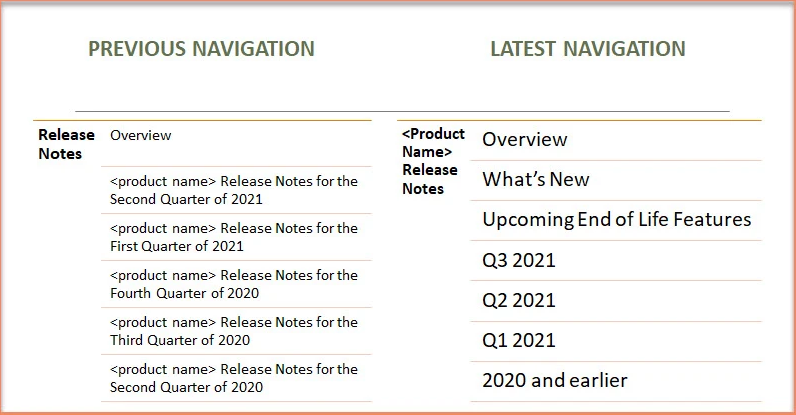

# The Curious Case of Release Notes

Release Notes are the most popular form of documentation for any release. While the users wait for this document to be made available, writers are as anxious to provide a high-quality content for this highly visible and awaited document. 

## Challenge

A monolithic Release Notes document tied together release notes for all previous versions since the beginning. Since writers work on multiple parallel branches and trunk based on the releases are in progress at one point in time, there was continuous requirement to duplicate the effort to other parallel branches and the trunk as well to have the ability of deliver this monolithic Release Notes package.

## Approach

Analyzing the requirement for both product/release notes environments, cloud and on-premiseUnderstanding the requirement to continue to tie all the release notes togetherFocus solution towards the goal of reducing duplicate effort being spent by the writers in various source branches/trunkCreating a Proof of Concept (POC) to gain stakeholder alignment and buy-in. Stakeholders here would be writers as well as product ownersOwning the implementation and delivery of the release notes experience and the technical solution defined.

## Solution

After discussing several approaches, we were able to finalize the following solution:

- Split the release notes year wise.
- Provide a placeholder to link the consolidated release notes till last year
- For each subsequent year, a new placeholder will be added for the previous year's release note package.

## Result

With this approach:

- Product users continue to get consolidated release notes 
- Technical writers do not need to duplicate the effort
- The package size reduced to 1/10th, reducing the upload time

## Adds on

- Brevity in left navigation
- Product name added only once
- New sections added in same page area

## Example

- [Click to view an example](ge.com/digital/documentation/predix-apm/latest/release-notes/previous/2021/release-notes.html).

    