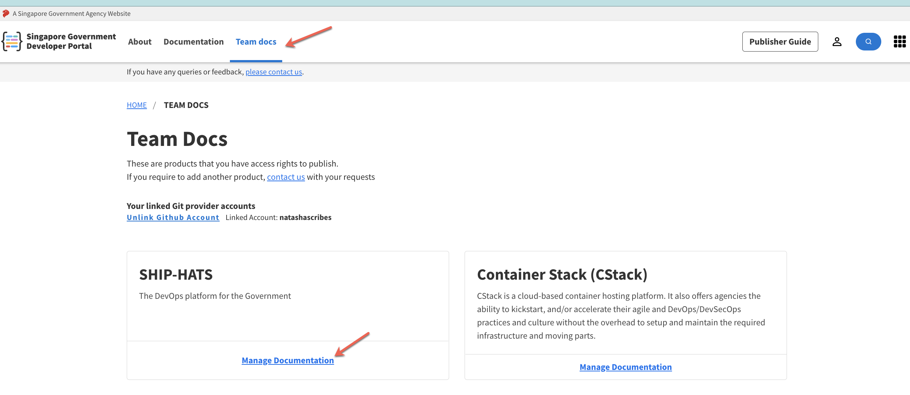
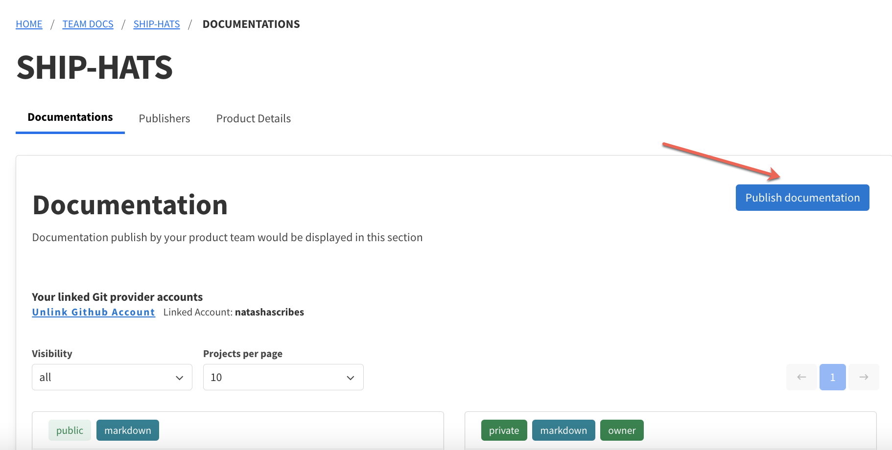
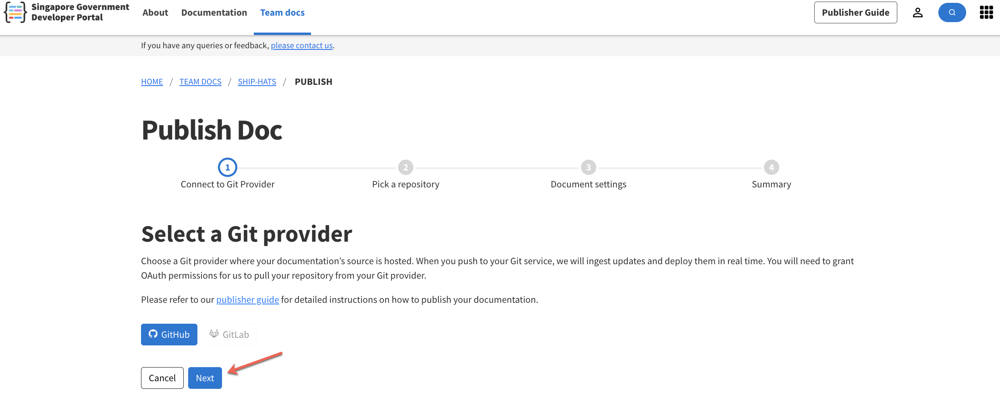
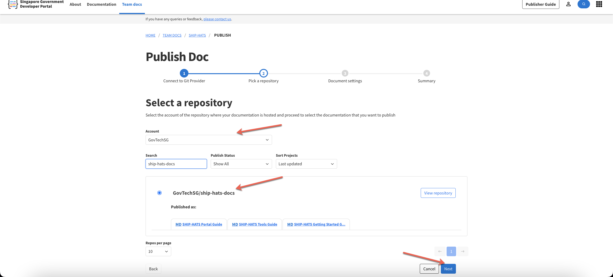

# Publishing

## Branching in GitHub

Use only two branches in GitHub:

|Branch Name|Purpose/Description|
|---|---|
|**Main/Master**| Use this for submitting day-to-day work. This branch will be used to publish content to *Staging* portal|
|**Release/production**| Use this for submitting release work or when you want to push to production. You will need to create pull requests from this branch to get the changes in before you can push to production. This branch will be used to publish content to the *Production* portal.|

## Publish output from main repo

Use these option when you have to:
- Publish one output only
- Publish output from main repo

[Default Publishing Steps](snippets/snippet-publishing.md ':include')
1. Provide value in the **Basepath** field based on following conditions:
    - If this is the output from main repo, leave this blank. 
    - If this is the output from a folder within main repo, add the folder name here.
1. Provide value in the **HomePage** field based on following conditions:     
    - If you do not specify any value, by default, README.md is selected as homepage when you generate the output. 
    - If
1. Provide value in the **Branch To Be Used For Deployment** field based on following conditions:    
    - **Important!** This is what makes the difference between staging and production.  

    |Condition|Values to be selected|  
    |---|---|  
    |**Staging** output|Choose the default branch (**main**). As a standard practice, name it **master**.|
    |**Production** output|Choose the GitHub branch created for releasing the final docs. As a standard practice, name it **release**.|
1. Provide value in the **User Permissions** field based on following conditions:    
    - **Important!** This is what makes the difference between a user logged in via TechPass vs providing access to  specific people via email.     

    |Option|Condition|  
    |---|---|
    |**Any logged in user can view this document**| If you anyone on Internet should be able to access the doc. Do **not** choose this for *Staging*.
    |**Only those approved can view**|If you want to provode access to restricted people hoose Only those approved can view|
1. Provide values in the **Add users** field, and then select **Add** for each email address. 
    - This field appears only when you select **Only those approved can view** in the previous step. 
    - Enter email address in **lower case** only. When you copy email address from outlook, it might have mixed case. Change this to lower case to ensure user can access. 
    - You can provide access to multiple email addresses.

## Publish output from folder in main repo

> **IMPORTANT:**  
> Use this option to publish multiple guides/outputs from same repo. Do not create multiple repos for one product just to get multiple outputs. 

### Prerequisites

### To publish multiple outputs from same repo

1. Navigate to **Team docs**.
    <kbd>
1. On the repo or product for which you want to publish doc, select **Manage Documentation**. 
1. Select **Publish documentation**.
    <kbd>

1. Select **Next**.
    <kbd>

1. In **Account**, select *GovTechSG*. 
1. Search for your repo, select the repo, and then select **Next**.
    <kbd>

1. Provide values in following fields:
    |Field|Description|
    |---|---|
    |Product|It is auto populated.
    |Repository|It is auto populated. 
    |Documentation display name|
    |Documentation description|
    |Documentation URL|Your documentation display name determines its URL. It is auto populated.|
    |Documentation Card Preview (users see this when browsing)|It is auto populated.|
    |Support Email|By default, this is populated with email of person creating the repo. Update this to team or product email address.|
    |Documentation visibility|Choose who can read your documentation - public internet (**Public**) or only logged-in users (**Private**).|
    |Documentation type|Choose **Markdown** if you are writing text pages, or **OpenAPI/Swagger** if you are publishing API documentation via an OpenAPI document.| 
    |Docsify settings|You can click the link for better understanding.|
    |Hide Sidebar|Leave this blank to avoid hiding the sidebar.|
    |SubMax level|Select a number to indcate the heading levels that you want to appear in left nav/sidebar. For example, a number 2 would show H1 and H2 in left nav/sidebar whereas a number 3 would show H1, H2, and H3 in left nav/sidebar.|
1. Provide value in the **Basepath** field based on following conditions:
    - If this is the output from main repo, leave this blank. 
    - If this is the output from a folder within main repo, add the folder name here.
1. Provide value in the **HomePage** field based on following conditions:     
    - If you do not specify any value, by default, README.md is selected as homepage when you generate the output. 
    - If
1. Provide value in the **Branch To Be Used For Deployment** field based on following conditions:    
    - **Important!** This is what makes the difference between staging and production.  

    |Condition|Values to be selected|  
    |---|---|  
    |**Staging** output|Choose the default branch (**main**). As a standard practice, name it **master**.|
    |**Production** output|Choose the GitHub branch created for releasing the final docs. As a standard practice, name it **release**.|
1. Provide value in the **User Permissions** field based on following conditions:    
    - **Important!** This is what makes the difference between a user logged in via TechPass vs providing access to  specific people via email.     

    |Option|Condition|  
    |---|---|
    |**Any logged in user can view this document**| If you anyone on Internet should be able to access the doc. Do **not** choose this for *Staging*.
    |**Only those approved can view**|If you want to provode access to restricted people hoose Only those approved can view|
1. Provide values in the **Add users** field, and then select **Add** for each email address. 
    - This field appears only when you select **Only those approved can view** in the previous step. 
    - Enter email address in **lower case** only. When you copy email address from outlook, it might have mixed case. Change this to lower case to ensure user can access. 
    - You can provide access to multiple email addresses. 
1. Click **Next** and review the information carefully.
1. Click **Publish Documentation**.   
    It will take a few minutes to publish the content but card will appear immediately. 

## Publishing staging output

**Use this option to publish content for internal review.**  

Using this option will help you: 
1. To check in your content to GitHub at the end of the day rather than just leaving it on your local. You will never lose your changes!
1. To publish content on external customer portal based on release date or a candence, such as once a month rather than releasing every day and testing!

### To publish staging output
1. 

## Publishing setup

---
## Publishing on GitHub

---
## Delivering PDFs

---
### Generating a PDF

---
### Publishing or Sharing a PDF

---